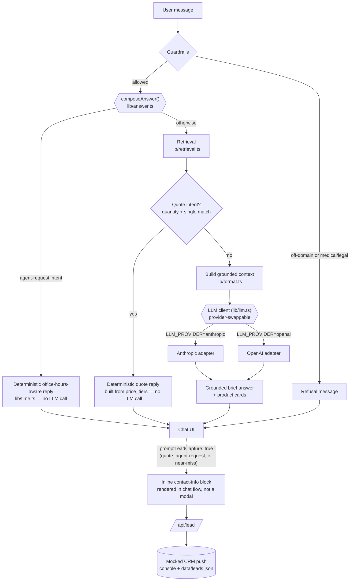

# ASC Product & Compliance Assistant

> **Independent portfolio project.** Not affiliated with or endorsed by American
> Screening Corp. Product data and pricing are from public pages, illustrative,
> and may be out of date. Verify all details on the official site.

A grounded, guardrailed product-finder chat assistant for a drug and alcohol
screening supplier's public catalog — built to demonstrate applied-AI
engineering: retrieval grounding, rule-based safety guardrails, a
provider-swappable LLM layer, and an eval harness that scores the whole thing.

## The problem it solves

The target company's live site has a chat widget ("Sophia") that behaves as a
scripted lead-capture form: it collects name → email → phone, cannot answer
product questions, and on a real product question replies "a specialist will
email you." It also has a generic LLM bolted on with no grounding and no
guardrails — it will answer an unrelated request just as readily as a product
one. High-intent buyers who ask a specific product question get a callback
queue instead of an answer.

This assistant demonstrates the opposite pattern: answer the buyer's real
question first — grounded in the actual catalog, with compliance caution and
citations — and only then offer to capture the lead. **Answer, earn trust,
then qualify.**

## Architecture



- **Guardrails run before retrieval**, server-side, in `lib/guardrails.ts`.
  `scopeCheck()` blocks off-domain requests (recipes, weather, coding help,
  chit-chat); `complianceCheck()` blocks personal medical/legal-advice
  requests ("will I pass my test Friday?", "how do I detox?"). Both are
  rule-based (regex), not LLM calls — deterministic and fast, which matters
  for a scored eval harness. Each returns `{ allowed, reason, refusalMessage }`,
  a shape an LLM classifier could be dropped into later without touching
  callers.
- **Retrieval** (`lib/retrieval.ts`) is a keyword + structured filter over the
  52-product local catalog (`data/products.json`) — no vector DB. It parses
  intent (category, panel count, required substance flags, compliance
  preference, quantity), hard-filters the catalog, and falls back to a
  panel-count-relaxed "closest options" search when nothing matches exactly,
  so the assistant can say "no exact match, here's the closest" instead of
  fabricating one.
- **LLM layer** (`lib/llm.ts`) is a single interface (`LlmClient.complete()`)
  with adapters for Anthropic (default) and OpenAI, chosen by `LLM_PROVIDER`.
  It is the only place a provider SDK is imported; every caller goes through
  it.
- **Answer composition** (`lib/answer.ts`) sits between retrieval and the
  reply. `composeAnswer()` first checks for an agent-request intent
  (`lib/intent.ts`) and returns a deterministic, office-hours-aware reply
  (`lib/time.ts`) with no LLM call. Next it checks for a "quote" intent — a
  quantity plus a single matched product — and returns a reply built directly
  from that product's `price_tiers`, again without an LLM call, so the
  pricing arithmetic can't drift. Only the remaining no-match / near-miss /
  normal cases go to the LLM, each with mode-specific brevity instructions.
  The quote and agent-request paths, plus a near-miss, also set
  `promptLeadCapture: true`.
- **API routes**: `app/api/chat/route.ts` runs guardrails, then delegates
  everything else to `composeAnswer()`, returning `{ reply, products,
  refused, isNearMiss, promptLeadCapture, leadCaptureReason }`.
  `app/api/lead/route.ts` is a mocked "push to CRM" endpoint — it logs to
  console and best-effort appends to `data/leads.json`; no real CRM is
  connected.
- **UI** (`components/`) renders chat bubbles plus structured product cards
  (panels, screened-for, a cite-and-defer compliance line with a verify link,
  the full price ladder) independent of the LLM's prose, so the cards are
  always grounded in the same retrieval result the model saw. When
  `promptLeadCapture` is true, a contact-info block (first name, phone with a
  country-code picker, email, optional company) renders inline in the chat
  flow right after that message's cards — not a modal — and can be dismissed
  or skipped at any time.

## Running locally

```bash
npm install
cp .env.example .env.local   # then fill in your API key
npm run dev
```

Open http://localhost:3000.

### Environment variables

| Variable | Required | Default | Notes |
|---|---|---|---|
| `LLM_PROVIDER` | no | `anthropic` | `anthropic` or `openai` |
| `ANTHROPIC_API_KEY` | if provider is `anthropic` | — | |
| `ANTHROPIC_MODEL` | no | `claude-sonnet-5` | |
| `OPENAI_API_KEY` | if provider is `openai` | — | |
| `OPENAI_MODEL` | no | `gpt-4o-mini` | |

## Running the eval

```bash
npm run eval
```

Scores 17 fixed cases (`eval/cases.json`) spanning valid product finds,
fentanyl/CLIA/ETG/K2 substance-and-compliance filters, a bulk-price lookup and
a named-product quote (both exercising the deterministic quote template), a
genuine no-match case, an agent-request case, off-domain requests (pasta
recipe, weather, coding — the pasta case is the scored refusal case from the
spec), and medical/legal advice requests. It prints a scorecard to the
console and writes `eval/results.json` with full per-case detail.

Latest local run:

```
=== SCORECARD ===
┌──────────────────────────────────┬────────┬───────┬────────┐
│ (index)                          │ passed │ total │ pct    │
├──────────────────────────────────┼────────┼───────┼────────┤
│ Refusal correctness              │ 17     │ 17    │ '100%' │
│ Retrieval accuracy               │ 10     │ 10    │ '100%' │
│ Grounding (no fabricated prices) │ 11     │ 11    │ '100%' │
│ Compliance deferral              │ 11     │ 11    │ '100%' │
│ Lead-capture trigger correctness │ 11     │ 11    │ '100%' │
└──────────────────────────────────┴────────┴───────┴────────┘
```

The five metrics:
- **Refusal correctness** — off-domain/medical cases refused, product cases answered.
- **Retrieval accuracy** — the expected product(s) actually appear in the retrieved set.
- **Grounding** — no fabricated per-unit prices (computed totals like "$325.00"
  from 100 × $3.25 are allowed — that's arithmetic on a real per-unit price,
  not fabrication; only invented per-unit figures count as a failure). Citing
  the product isn't checked in the reply text itself — that's carried
  structurally by the product card attached to every product answer, not
  restated in prose.
- **Compliance deferral** — whenever the reply mentions CLIA/FDA/forensic
  status, it does so with "verify"-style deferral language, never as settled fact.
- **Lead-capture trigger correctness** — the contact-info prompt fires exactly
  when it should (after a quote, an agent request, or a near-miss offer) and
  not on ordinary answers or genuine no-match cases.

## Design decisions

- **Cite-and-defer on compliance, always.** Scraped compliance flags have
  known misses (see Limitations below) — one was manually corrected during
  data cleaning. In a regulated domain (FDA/CLIA/DOT), asserting compliance
  as fact is the wrong failure mode. Phrasing everything as "listed as
  {status} — verify on the linked page" keeps a human in the loop no matter
  how good the retrieval gets.
- **Provider-swappable LLM layer.** `lib/llm.ts` is the only interface any
  caller touches; adapters are swapped via `LLM_PROVIDER`. This is a small
  amount of extra structure for a single-provider v1, but it avoids lock-in
  and is a five-minute change to demo the other adapter.
- **Illustrative pricing, never a quote.** Public-page pricing can be stale
  or tiered in ways a scrape doesn't fully capture. Every price is labeled
  illustrative and the eval harness specifically checks that no per-unit
  price is stated that isn't in the underlying data.
- **Answer, then qualify.** The lead-capture prompt only appears after the
  assistant has actually answered a product question — never as the first
  interaction. This is the direct opposite of a scripted name→email→phone
  gate that blocks the user before they get any value.
- **Rule-based guardrails over an LLM classifier for v1.** Deterministic and
  fast, and it makes the eval harness reproducible rather than sensitive to
  a classifier's own variance. The `{allowed, reason, refusalMessage}` return
  shape is designed so an LLM classifier can be substituted later without
  changing any caller.

## Limitations & data provenance

- **Data provenance.** `data/products.json` (52 products) was scraped from
  public product pages. It has already been cleaned once: a fabricated/
  over-generalized `free_shipping_threshold` field was removed, and one
  product's compliance status ("Alco Screen Alcohol Test Strips") was
  corrected to "CLIA Waived" after manual verification against its product
  image. This kind of correction is exactly why compliance status is never
  asserted as fact in this app — if a flag was wrong once, treat all of them
  as needing verification.
- **`compliance_status: "Not Specified"`** is treated as genuinely unknown,
  not as "no restriction" — the assistant says so rather than guessing.
- **Pricing may be stale.** It reflects a snapshot of public pages at
  scrape time, not a live feed.
- **Retrieval is rule-based, not semantic.** It parses category, panel
  count, substance flags, compliance preference, and quantity via keyword
  matching. It won't catch every phrasing of a request, and it can't do
  fuzzy/semantic matching the way an embedding-based retriever could. For a
  52-product catalog this trade-off favors explainability and testability
  over recall on unusual phrasings.
- **Lead capture is fully mocked.** There is no real CRM/HubSpot
  integration. Submissions are logged to the console and best-effort
  appended to `data/leads.json`; on a read-only serverless filesystem (e.g.
  Vercel), the file write is skipped and only the console log + mocked
  response occur.
- **Guardrails are regex-based**, chosen for determinism and eval
  reproducibility over the broader (but less predictable) coverage an LLM
  classifier might offer. Off-domain and medical/legal patterns cover the
  cases in the eval set well but are not exhaustive.

## Roadmap / Future Enhancements

These are proposed next steps beyond this portfolio build, chosen for where they'd matter most to ASC's actual business:

- **Multilingual support** (English/Spanish/Chinese/Hindi) — pre-written translation strings for compliance-critical text (the cite-and-defer caveat, disclaimers) paired with the LLM for conversational replies, so the compliance wording stays exact and never drifts through translation. ASC ships to 100+ countries, so this is a real reach gap today.
- **Real CRM integration** — replace the mocked "push to HubSpot" step with a live HubSpot integration, since ASC already names HubSpot in their own requirements.
- **Live catalog sync** — replace the curated product snapshot with a sync from ASC's real catalog/Shopify, so pricing and stock never go stale.
- **SMS/OTP phone verification** (e.g. Twilio) for validated leads, confirming a submitted number is real and reachable rather than just shape-valid.
- **Extending the same grounded-agent pattern** (retrieval + guardrails + eval + human-in-the-loop) to other ASC workflows: background screening, compliance review, order processing.

## Deploying to Vercel

Push to a Git repo, import it in Vercel, and set the environment variables
from the table above (`ANTHROPIC_API_KEY` at minimum, since that's the
default provider). No other configuration is required — `data/products.json`
is bundled at build time, and lead capture degrades gracefully if the
filesystem is read-only.
